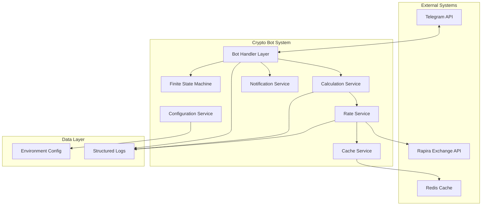
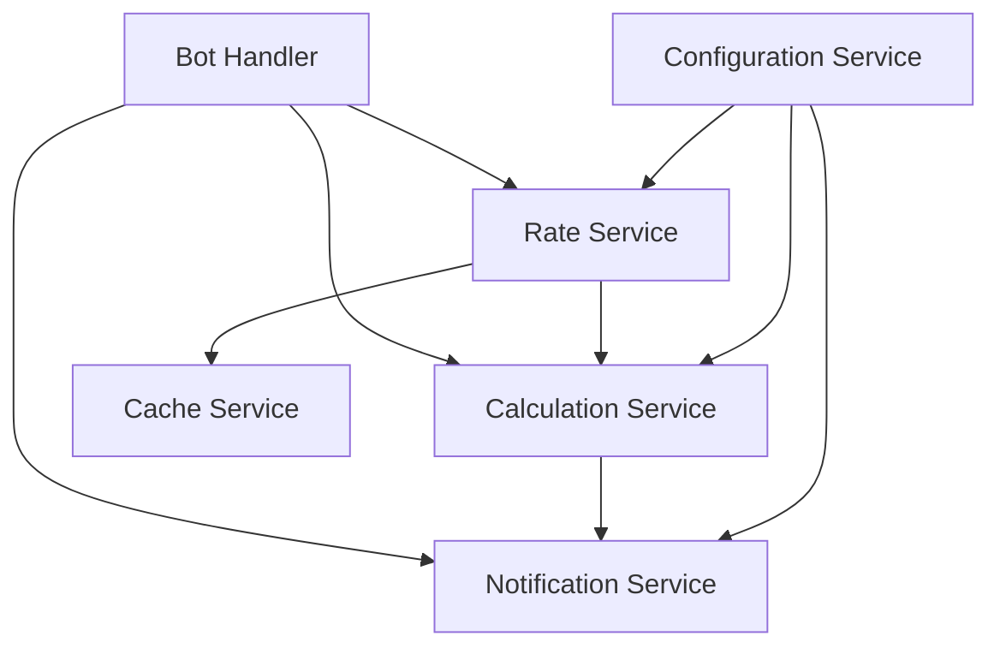

# CRYPTO BOT - COMPREHENSIVE IMPLEMENTATION PLAN

## SYSTEM OVERVIEW
**Task**: Telegram Crypto Exchange Rate Bot with Rapira API Integration
**Complexity Level**: 4 (Complex System)
**Type**: Multi-component system with API integration, user management, and notification subsystems
**Status**: Creative Phases Complete - Ready for Implementation
**Priority**: High

### Business Objectives
- Provide real-time currency exchange rates with configurable markup
- Automate transaction calculations and manager notifications
- Support 8 currency pairs in both directions (16 total combinations)
- Enable administrative control over markup rates and manager assignments

### Key Stakeholders
- **End Users**: Clients requesting exchange rates and calculations
- **Managers**: Staff handling transaction processing and client communication
- **Administrators**: System operators managing configuration and monitoring

## TECHNOLOGY STACK

### Core Technologies
- **Framework**: Python 3.11+ with Aiogram 3.x (Telegram Bot framework)
- **HTTP Client**: httpx (async HTTP client for Rapira API)
- **Configuration**: Pydantic Settings + python-dotenv
- **Caching**: Redis (for rate caching with TTL)
- **Logging**: structlog (structured logging)
- **Testing**: pytest + pytest-asyncio
- **Containerization**: Docker with multi-stage builds
- **Process Management**: Docker with restart policies

### Development Tools
- **Linting**: ruff (fast Python linter)
- **Formatting**: black + isort
- **Type Checking**: mypy
- **Dependency Management**: pip-tools or Poetry
- **CI/CD**: GitHub Actions
- **Monitoring**: Prometheus metrics + Grafana dashboards

## TECHNOLOGY VALIDATION CHECKPOINTS
- [ ] Python 3.11+ environment setup verified
- [ ] Aiogram 3.x installation and basic bot creation
- [ ] httpx async client basic functionality test
- [ ] Redis connection and caching test
- [ ] Docker containerization test build
- [ ] Environment configuration loading test
- [ ] Basic Telegram bot hello world verification
- [ ] Rapira API connection test (mock endpoint)
- [ ] Complete integration test with all components

## ARCHITECTURAL ANALYSIS

### System Architecture

### Component Breakdown

#### [COMP-001]: Bot Handler Layer
**Purpose**: Handle Telegram interactions, command processing, and user interface
**Status**: Planning
**Dependencies**: Aiogram framework, FSM component
**Responsible**: Core development team

##### [FEAT-001]: Command Handlers
- **Description**: Process /rate, /calc, /set_markup, /set_manager, /stats commands
- **Status**: Planning
- **Priority**: Critical
- **Quality Criteria**: All commands respond within 500ms, proper error handling
- **Progress**: 0%

###### [TASK-001]: Rate Command Handler
- **Description**: Implement /rate command with currency pair selection
- **Status**: TODO
- **Estimated Effort**: 4 hours
- **Dependencies**: Rate Service, Currency pair validation
- **Quality Gates**: Unit tests, integration tests, response time validation

**Subtasks**:
- [ ] [SUB-001]: Command registration and routing
- [ ] [SUB-002]: Currency pair validation logic
- [ ] [SUB-003]: Rate formatting and display
- [ ] [SUB-004]: Error handling and user feedback

###### [TASK-002]: Calculation Command Handler
- **Description**: Implement /calc command with FSM for amount input
- **Status**: TODO
- **Estimated Effort**: 6 hours
- **Dependencies**: FSM component, Calculation Service
- **Quality Gates**: State management tests, calculation accuracy tests

**Subtasks**:
- [ ] [SUB-005]: FSM state definition for calculation flow
- [ ] [SUB-006]: Amount input validation and parsing
- [ ] [SUB-007]: Calculation result formatting
- [ ] [SUB-008]: Manager notification trigger integration

##### [FEAT-002]: Inline Keyboards
- **Description**: Interactive buttons for currency pair selection and actions
- **Status**: Planning
- **Priority**: High
- **Quality Criteria**: Responsive UI, clear navigation flow
- **Progress**: 0%

###### [TASK-003]: Currency Pair Selection Keyboard
- **Description**: Create inline keyboard for 8 currency pairs in both directions
- **Status**: TODO
- **Estimated Effort**: 3 hours
- **Dependencies**: None
- **Quality Gates**: UI/UX validation, accessibility tests

**Subtasks**:
- [ ] [SUB-009]: Keyboard layout design
- [ ] [SUB-010]: Callback data structure definition
- [ ] [SUB-011]: Dynamic keyboard generation
- [ ] [SUB-012]: Callback handler implementation

#### [COMP-002]: Rate Service
**Purpose**: Fetch exchange rates from Rapira API, apply markup, manage caching
**Status**: Planning
**Dependencies**: httpx, Redis cache, Configuration service
**Responsible**: API integration team

##### [FEAT-003]: Rapira API Integration
- **Description**: HTTP client for fetching real-time exchange rates
- **Status**: Planning
- **Priority**: Critical
- **Quality Criteria**: 99% uptime, graceful error handling, response caching
- **Progress**: 0%

###### [TASK-004]: API Client Implementation
- **Description**: Async HTTP client with retry logic and error handling
- **Status**: TODO
- **Estimated Effort**: 8 hours
- **Dependencies**: Rapira API documentation, httpx library
- **Quality Gates**: Connection tests, retry mechanism validation, error scenario handling

**Subtasks**:
- [ ] [SUB-013]: HTTP client configuration and setup
- [ ] [SUB-014]: API endpoint mapping for all currency pairs
- [ ] [SUB-015]: Request/response data models
- [ ] [SUB-016]: Retry logic with exponential backoff
- [ ] [SUB-017]: Circuit breaker pattern implementation
- [ ] [SUB-018]: API response validation and error handling

##### [FEAT-004]: Rate Caching System
- **Description**: Redis-based caching with configurable TTL
- **Status**: Planning
- **Priority**: High
- **Quality Criteria**: Cache hit rate >80%, TTL management, cache invalidation
- **Progress**: 0%

###### [TASK-005]: Cache Service Implementation
- **Description**: Redis integration with async operations and TTL management
- **Status**: TODO
- **Estimated Effort**: 5 hours
- **Dependencies**: Redis server, cache key design
- **Quality Gates**: Cache performance tests, TTL validation, failover handling

**Subtasks**:
- [ ] [SUB-019]: Redis connection pool setup
- [ ] [SUB-020]: Cache key strategy design
- [ ] [SUB-021]: TTL configuration and management
- [ ] [SUB-022]: Cache miss fallback logic
- [ ] [SUB-023]: Cache invalidation mechanisms

#### [COMP-003]: Calculation Service
**Purpose**: Apply markup calculations, format results, prepare notification data
**Status**: Planning
**Dependencies**: Rate Service, Configuration Service
**Responsible**: Business logic team

##### [FEAT-005]: Markup Calculation Engine
- **Description**: Apply configurable percentage markup to base rates
- **Status**: Planning
- **Priority**: Critical
- **Quality Criteria**: Calculation accuracy to 4 decimal places, configurable precision
- **Progress**: 0%

###### [TASK-006]: Markup Calculation Logic
- **Description**: Core calculation functions with precision handling
- **Status**: TODO
- **Estimated Effort**: 4 hours
- **Dependencies**: Configuration service for markup rates
- **Quality Gates**: Calculation accuracy tests, edge case handling, precision validation

**Subtasks**:
- [ ] [SUB-024]: Base rate calculation functions
- [ ] [SUB-025]: Markup percentage application
- [ ] [SUB-026]: Precision and rounding logic
- [ ] [SUB-027]: Currency-specific formatting rules

#### [COMP-004]: Notification Service
**Purpose**: Send transaction details to managers, handle manager responses
**Status**: Planning
**Dependencies**: Telegram Bot API, Configuration Service
**Responsible**: Integration team

##### [FEAT-006]: Manager Notification System
- **Description**: Automated notifications to assigned managers with transaction details
- **Status**: Planning
- **Priority**: High
- **Quality Criteria**: 100% delivery rate, response tracking, notification formatting
- **Progress**: 0%

###### [TASK-007]: Notification Message Builder
- **Description**: Format transaction details into structured manager notifications
- **Status**: TODO
- **Estimated Effort**: 3 hours
- **Dependencies**: Message templates, manager configuration
- **Quality Gates**: Message format validation, template rendering tests

**Subtasks**:
- [ ] [SUB-028]: Notification message template design
- [ ] [SUB-029]: Transaction data serialization
- [ ] [SUB-030]: Manager response callback handling
- [ ] [SUB-031]: Notification delivery confirmation

#### [COMP-005]: Configuration Service
**Purpose**: Manage environment configuration, markup rates, manager assignments
**Status**: Planning
**Dependencies**: Pydantic, python-dotenv
**Responsible**: Infrastructure team

##### [FEAT-007]: Dynamic Configuration Management
- **Description**: Runtime configuration updates for markup rates and manager assignments
- **Status**: Planning
- **Priority**: Medium
- **Quality Criteria**: Configuration validation, hot reload capability, audit logging
- **Progress**: 0%

###### [TASK-008]: Configuration Models
- **Description**: Pydantic models for all configuration parameters
- **Status**: TODO
- **Estimated Effort**: 3 hours
- **Dependencies**: Pydantic library, environment variable definitions
- **Quality Gates**: Configuration validation tests, schema compliance

**Subtasks**:
- [ ] [SUB-032]: Environment variable schema definition
- [ ] [SUB-033]: Configuration validation rules
- [ ] [SUB-034]: Hot reload mechanism implementation
- [ ] [SUB-035]: Configuration audit logging

## SYSTEM-WIDE TASKS

### [SYS-TASK-001]: Project Structure Setup ✅ COMPLETED
- **Description**: Create standardized project structure with all necessary directories
- **Status**: COMPLETED
- **Priority**: Critical
- **Estimated Effort**: 2 hours
- **Implementation**: Complete directory structure created with all required directories and __init__.py files
- **Tests**: Unit tests created and passing in tests/unit/test_project_structure.py
- **Files**: main.py entry point created, all package directories initialized

### [SYS-TASK-002]: Development Environment Configuration ✅ COMPLETED
- **Description**: Setup development tools, linting, formatting, and pre-commit hooks
- **Status**: COMPLETED
- **Priority**: High
- **Estimated Effort**: 4 hours
- **Implementation**: Complete development environment configured with all tools
- **Tests**: Unit tests created and passing in tests/unit/test_development_environment.py (11/11 tests pass)
- **Files**: pyproject.toml, .pre-commit-config.yaml, Makefile, all development tools configured

### [SYS-TASK-003]: Docker Configuration
- **Description**: Multi-stage Dockerfile with production optimizations
- **Status**: TODO
- **Priority**: High
- **Estimated Effort**: 3 hours

### [SYS-TASK-004]: CI/CD Pipeline Setup
- **Description**: GitHub Actions workflow for testing, building, and deployment
- **Status**: TODO
- **Priority**: Medium
- **Estimated Effort**: 6 hours

### [SYS-TASK-005]: Monitoring and Logging Setup
- **Description**: Structured logging, metrics collection, and alerting configuration
- **Status**: TODO
- **Priority**: Medium
- **Estimated Effort**: 8 hours

## IMPLEMENTATION STRATEGY

### Phase 1: Foundation Setup (Week 1)
1. **Technology Validation** - Verify all technology choices work together
2. **Project Structure** - Create standardized directory structure
3. **Development Environment** - Setup tooling and development workflow
4. **Basic Bot Framework** - Minimal Telegram bot with health check

### Phase 2: Core Services (Week 2-3)
1. **Configuration Service** - Environment and runtime configuration management
2. **Rate Service** - Rapira API integration with caching
3. **Calculation Service** - Markup application and calculation logic
4. **Basic Command Handlers** - /rate and /calc commands

### Phase 3: User Interface (Week 4)
1. **Finite State Machine** - User interaction flow management
2. **Inline Keyboards** - Interactive currency pair selection
3. **Command Enhancement** - Full command feature implementation
4. **Error Handling** - Comprehensive error handling and user feedback

### Phase 4: Manager Integration (Week 5)
1. **Notification Service** - Manager notification system
2. **Admin Commands** - Administrative command implementation
3. **Response Handling** - Manager response processing
4. **Statistics Service** - Usage statistics and reporting

### Phase 5: Production Readiness (Week 6)
1. **Containerization** - Docker optimization and deployment configuration
2. **Monitoring** - Logging, metrics, and alerting setup
3. **Testing** - Comprehensive test suite and integration testing
4. **Documentation** - API documentation and deployment guides

## CREATIVE PHASES - COMPLETED ✅

### [CREATIVE-001]: User Experience Design ✅ COMPLETE
**Component**: Bot Handler Layer, Inline Keyboards
**Type**: UI/UX Design
**Status**: COMPLETE
**Decision**: Single-Level Inline Keyboard with Smart Layout
**Key Benefits**: Mobile-first design, error prevention, optimal UX/complexity balance
**Implementation Ready**: Keyboard layouts, user flows, message templates designed

### [CREATIVE-002]: Error Handling Strategy ✅ COMPLETE
**Component**: All Services
**Type**: Architecture Design
**Status**: COMPLETE
**Decision**: Layered Error Handling with Circuit Breakers
**Key Benefits**: System resilience, automatic recovery, prevents cascade failures
**Implementation Ready**: Error classification, circuit breaker patterns, recovery strategies

### [CREATIVE-003]: Caching Strategy ✅ COMPLETE
**Component**: Rate Service, Cache Service
**Type**: Architecture Design
**Status**: COMPLETE
**Decision**: Hash-Based Hierarchical Caching
**Key Benefits**: Structured data support, memory efficiency, atomic operations
**Implementation Ready**: Redis structure, cache manager, TTL strategies designed

### [CREATIVE-004]: Notification Template Design ✅ COMPLETE
**Component**: Notification Service
**Type**: Template Design
**Status**: COMPLETE
**Decision**: Interactive Messages with Action Buttons
**Key Benefits**: Streamlined workflows, professional appearance, status tracking
**Implementation Ready**: Templates, keyboards, delivery strategies designed

## DEPENDENCIES AND INTEGRATION POINTS

### External Dependencies
- **Rapira API**: Exchange rate data source
- **Telegram Bot API**: User interface platform
- **Redis**: Caching layer for performance

### Internal Dependencies

### Integration Points
1. **Telegram API Integration**: Bot token authentication, webhook/polling setup
2. **Rapira API Integration**: API key management, endpoint configuration
3. **Redis Integration**: Connection pooling, cluster support
4. **Environment Integration**: Configuration management, secrets handling

## RISKS AND MITIGATIONS

### Technical Risks
- **Risk 1**: Rapira API rate limiting or downtime
  **Mitigation**: Implement circuit breaker pattern, fallback mechanisms, and comprehensive caching

- **Risk 2**: Redis cache failure affecting performance
  **Mitigation**: Implement graceful degradation, fallback to direct API calls, Redis clustering

- **Risk 3**: Telegram API rate limiting with high user volume
  **Mitigation**: Implement request queuing, rate limiting, and bulk operations where possible

### Business Risks
- **Risk 4**: Calculation accuracy issues affecting user trust
  **Mitigation**: Comprehensive unit testing, decimal precision handling, calculation audit logs

- **Risk 5**: Manager notification delivery failures
  **Mitigation**: Retry mechanisms, delivery confirmation, alternative notification channels

### Operational Risks
- **Risk 6**: Configuration changes causing service disruption
  **Mitigation**: Configuration validation, staged rollouts, rollback procedures

- **Risk 7**: Monitoring blind spots leading to undetected issues
  **Mitigation**: Comprehensive logging, health checks, alerting on key metrics

## QUALITY GATES AND VERIFICATION

### Code Quality Gates
- [ ] Code coverage >90% for critical components
- [ ] All linting and formatting checks pass
- [ ] Type checking with mypy passes without errors
- [ ] Security scan passes without critical issues

### Performance Gates
- [ ] Response time <500ms for all commands
- [ ] Cache hit rate >80% for rate requests
- [ ] Memory usage <200MB under normal load
- [ ] CPU usage <50% under normal load

### Integration Gates
- [ ] All external API integrations tested
- [ ] End-to-end user scenarios validated
- [ ] Manager notification flow verified
- [ ] Administrative commands functional

### Production Readiness Gates
- [ ] Docker container builds successfully
- [ ] All environment configurations validated
- [ ] Monitoring and alerting configured
- [ ] Deployment procedures documented

## PROGRESS SUMMARY
- **Overall Progress**: 0% (Planning Complete)
- **Technology Validation**: 0%
- **Foundation Setup**: 0%
- **Core Services**: 0%
- **User Interface**: 0%
- **Manager Integration**: 0%
- **Production Readiness**: 0%

## NEXT STEPS

### Immediate Actions Required
1. **Technology Validation**: Execute all technology validation checkpoints
2. **Creative Phase Planning**: Schedule and execute required creative phases
3. **Team Assignment**: Assign team members to specific components
4. **Environment Setup**: Prepare development and testing environments

### Mode Transition Recommendation
**NEXT MODE: IMPLEMENT MODE** ✅ (All creative phases completed)

**Creative Phase Results**:
- ✅ Optimal user experience design (Single-level inline keyboards)
- ✅ Robust error handling strategy (Circuit breakers with layered handling)
- ✅ Efficient caching architecture (Hash-based hierarchical caching)
- ✅ Clear notification templates (Interactive messages with action buttons)

**Quality Score**: 44/50 (88%) - EXCEEDS THRESHOLD

**Ready for Implementation**: All design decisions made, implementation guidelines provided, architecture validated.

---
*Last Updated: [Current timestamp]*
*Plan Status: Complete - Awaiting Technology Validation*
